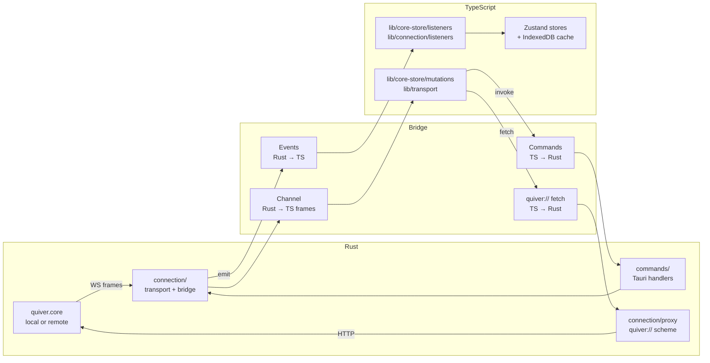
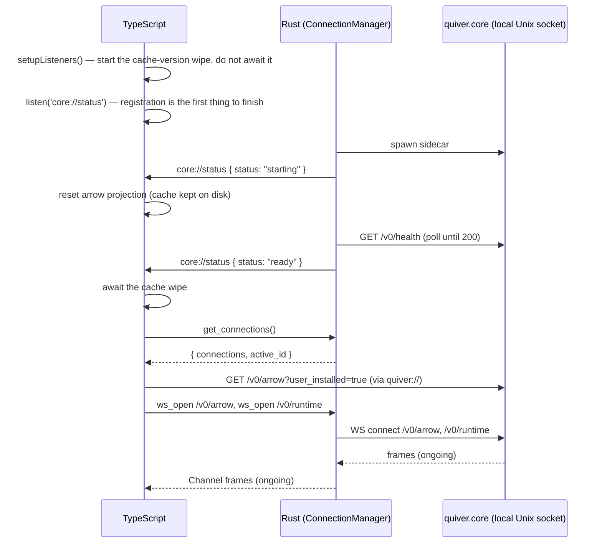

# Quiver Desktop — IPC Bridge

## Overview

The IPC bridge is the contract between the Rust backend and the TypeScript frontend inside the Tauri process. It is the only communication channel between the two sides — neither side reaches into the other's internals.

The bridge has three channels:

- **Events** (Rust → TypeScript): Rust emits typed JSON payloads that TypeScript subscribes to. Used only for lifecycle facts the webview cannot observe for itself — connection status and the connection list.
- **Commands** (TypeScript → Rust): TypeScript calls named Rust functions via `invoke()`. Used for connection management and for opening/closing the WebSocket legs.
- **The `quiver://` scheme** (TypeScript → Rust → quiver.core): every HTTP call to quiver.core. TypeScript issues an ordinary `fetch()` against `quiver://localhost/v0/...`; Rust's registered scheme handler proxies it to whatever connection is active.

Rust still owns every socket — TypeScript never opens one to quiver.core. What TypeScript owns is the *request*: reads and mutations are `fetch` calls over the `quiver://` scheme rather than per-endpoint Rust commands, and catalog/runtime data arrives on WebSockets bridged through Tauri Channels rather than on Tauri events.

Related specs: [connection-architecture.md](connection-architecture.md) (Rust + TypeScript implementation).

---

## 1. Architecture



The Rust side maintains one `ConnectionManager` as Tauri managed state. It holds the single active `QuiverConnection` — either a local Unix socket connection (loopback TCP on Windows) or a remote TCP connection — and the persisted list of remote configs. Commands receive it via `State<'_, ConnectionManager>`. A second managed state, `WsBridgeManager`, owns the open WebSocket legs.

The TypeScript side maintains `useArrowStore`, `useStatusStore` and `useConnectionStore` Zustand instances. `useConnectionStore` is populated by events and command responses. `useArrowStore` is a projection over an IndexedDB entity cache fed by the `/v0/arrow` WebSocket, with an in-memory runtime overlay fed by the `/v0/runtime` WebSocket.

---

## 2. Events (Rust → TypeScript)

Events are emitted by the Rust `Emitter` trait, implemented on `AppHandle`. All payloads are serialised as JSON. TypeScript subscribes via `listen()` from `@tauri-apps/api/event`.

There are exactly two. Data no longer travels by event: the arrow catalog and runtime transitions ride the WebSocket bridge (§4) instead, because an event carries no backpressure, no ordering guarantee against a concurrent GET, and nothing to persist.

### 2.1 Event Catalog

| Event | When emitted | Frequency |
|---|---|---|
| `core://status` | Active connection starts, becomes ready, or fails | Low — lifecycle only |
| `connection://changed` | `add_connection`, `remove_connection`, `rename_connection` | Low — user-triggered |

---

### 2.2 `core://status`

Emitted when the active connection lifecycle state changes. TypeScript uses this to show a connection indicator in the UI. On `starting`, TypeScript disposes both streams and resets the arrow projection (the on-disk cache is deliberately kept, so switching back paints instantly). On `ready`, TypeScript calls `get_connections()` to learn the active connection and opens the two streams against it.

**Payload:**

```typescript
{ status: "starting" | "ready" | "disconnected" }
```

**Sequence — initial launch (local connection):**

```
ConnectionManager starts  → emit { status: "starting" }
Health check passes       → emit { status: "ready" }   ← TS opens its streams here
Sidecar spawn or health
check fails               → emit { status: "disconnected" }
```

**Sequence — connection switch:**

```
switch_connection called  → retire the outgoing connection's WS legs, tear it down
New connection starts     → emit { status: "starting" }   ← TS resets projection here
                          → emit { status: "ready" }      ← TS reopens streams here
```

`switch_connection` emits no `connection://changed` — see §3.3. The `ready` handler therefore does not rely on one: it calls `get_connections()` itself.

**The emit is fire-and-forget.** `Emitter::emit_core_status` discards the result, Tauri buffers nothing, and there is no command to ask for the current status. An event emitted before the webview has registered its listener is dropped for good — and Rust emits `ready` on its *first* successful `/v0/health`, with no initial delay, so against an already-running daemon that can happen before `listen()` resolves. TypeScript must not treat this event as the only way it can learn the core is up. See §6.

---

### 2.3 `connection://changed`

Emitted after `add_connection`, `remove_connection` and `rename_connection`. Consumed by `lib/connection/listeners.ts`, which is the only subscriber, and which drives the connections UI.

**Payload:**

```typescript
{
    connections: ConnectionConfig[]
    active_id:   string
}
```

`switch_connection` does **not** emit it: `ConnectionManager::switch_connection` awaits `guard.start(app)`, which emits `core://status: starting` and then `ready` before the command returns, so an appended emit would land after the `ready` that already restarted the streams. Anything that needs the active connection reads it from `get_connections()` rather than from this event.

---

## 3. Commands (TypeScript → Rust)

Commands are invoked via `invoke(commandName, args)` from `@tauri-apps/api/core`. All commands are async. On success they resolve to the specified return type. On failure they reject.

There are eight, and none of them proxies a quiver.core endpoint: five manage connections, three manage WebSocket legs. Everything else quiver.core offers is reached with `fetch` over the `quiver://` scheme (§5).

### 3.1 Command Catalog

**Connection management** — handled entirely in Rust, do not call quiver.core:

| Command | Returns | Description |
|---|---|---|
| `get_connections` | `{ connections, active_id }` | Current connection list and active ID |
| `add_connection` | `ConnectionConfig` | Persist new remote connection |
| `remove_connection` | `void` | Delete connection metadata and token |
| `switch_connection` | `void` | Retire the active connection's streams, tear it down, start the new one |
| `rename_connection` | `void` | Update display name only |

**WebSocket bridge** — dial quiver.core over the active connection's transport:

| Command | Returns | Description |
|---|---|---|
| `ws_open` | `void` | Dial `path`, upgrade to WS, stream frames down a `Channel<string>` |
| `ws_send` | `void` | Send one raw text frame on an open leg |
| `ws_close` | `void` | Close a leg and drop its socket |

---

### 3.2 Connection commands

**`get_connections`**

```typescript
invoke('get_connections'): Promise<{ connections: ConnectionConfig[], active_id: string }>
```

Returns the full connection list and active ID. Called on `core://status: ready` — every time, because it is the only reliable answer to "which connection is active now" (§2.3) — and on-demand for resync.

**`add_connection`**

```typescript
invoke('add_connection', {
    name:  string,
    url:   string,    // e.g. "tcp://10.0.1.5:40257"
    token: string,
}): Promise<ConnectionConfig>
```

Persists the connection metadata to the store and the token to the OS keychain. Negotiates API version via `GET /versions` against the remote host before returning. Picks the highest version in `api.supported` that the desktop can speak; falls back to `v0` on 404.

**`remove_connection`**

```typescript
invoke('remove_connection', {
    id: string
}): Promise<void>
```

The local connection (`id: "local"`) cannot be removed — returns an error.

**`switch_connection`**

```typescript
invoke('switch_connection', {
    id: string
}): Promise<void>
```

Builds the new connection first, so a switch that cannot be completed leaves the current one untouched. Then retires every open WebSocket leg (their ids address the peer being left, and the frontend reopens fresh ids against the new connection), tears down the outgoing connection, and starts the new one — which emits `core://status: starting` and then `ready`.

**`rename_connection`**

```typescript
invoke('rename_connection', {
    id:   string,
    name: string,
}): Promise<void>
```

The local connection cannot be renamed — returns an error.

---

### 3.3 WebSocket commands

See §4 for the frame contract these three implement.

**`ws_open`**

```typescript
invoke('ws_open', {
    connId:    string,          // minted client-side (crypto.randomUUID)
    path:      string,          // full route, e.g. "/v0/arrow"
    onMessage: Channel<string>, // @tauri-apps/api/core Channel
}): Promise<void>
```

Resolves the active transport *per open*, so a leg opened after a switch dials the new peer with nothing to re-register. Resolves once the HTTP→WS upgrade has completed and the leg is registered; rejects with a string if the dial or upgrade fails.

**`ws_send`**

```typescript
invoke('ws_send', {
    connId: string,
    data:   string,    // raw text frame
}): Promise<void>
```

**`ws_close`**

```typescript
invoke('ws_close', {
    connId: string
}): Promise<void>
```

A `ws_close` for an unknown `connId` is a no-op, which matters: `connId` is minted before `ws_open` is invoked, but Rust only registers the leg once the dial completes, so a close racing ahead of registration must be re-issued afterwards. `QuiverWebSocket` does exactly that.

---

## 4. WebSocket bridge (Rust → TypeScript frames)

The browser `WebSocket` constructor cannot reach the daemon: on a local connection its only endpoint is a Unix socket, and the webview rejects every scheme but `ws`/`wss`. So Rust is the WebSocket client. It dials the daemon, performs the upgrade for a given `/v0/...` path, and forwards each text frame down the `Channel<string>` passed to `ws_open`.

`QuiverWebSocket` (`lib/transport/quiver-socket.ts`) presents the subset of the `WebSocket` interface `wsManager` needs — `onopen`/`onmessage`/`onclose`/`onerror`, `send`, `close`, `readyState` — over those three commands, so nothing above the transport layer knows the difference.

**Frames arrive raw.** The Channel carries the DTO text exactly as the daemon sent it; the shim surfaces it as `{ data: text }` to mirror a native `MessageEvent`.

**Close sentinel.** A daemon-side close (restart, timeout, error) is announced as one reserved frame:

```
"\u0000quiver-ws-close"   // connection::bridge::WS_CLOSE_SENTINEL
```

The NUL prefix cannot collide with a JSON DTO frame, so the shim treats it as a close rather than a message, which makes `wsManager` reconnect with backoff and hand every subscriber a `{ reconnected: true }` sentinel. The entity stream reacts by re-running its seed GET — frames missed during an outage cannot be recovered from a DTO merge.

Legs are also retired, silently and without the sentinel, when a page load starts (the outgoing page's JS will never close ids it no longer remembers) and when a connection switch happens (their ids address the peer being left).

Two endpoints are bridged:

| Path | Role | Consumer |
|---|---|---|
| `/v0/arrow` | Catalog deltas — `{ event: "upserted" \| "removed", namespace, ... }` | `lib/persistence/entity-stream.ts`, merged into the IndexedDB cache |
| `/v0/runtime` | Runtime transitions — `{ namespace, state, active_run, last_return }` | `lib/core-store/listeners`, applied as an overlay onto existing entries only |

Neither endpoint pushes anything on connect (both are transition-only, verified against `stable-26.5.1`). The initial state of every arrow therefore comes from the seed GET's own `versions[].state`, not from a frame.

---

## 5. The `quiver://` scheme (HTTP to quiver.core)

Registered with `.register_asynchronous_uri_scheme_protocol("quiver", ...)`. Requests arrive as `quiver://localhost/v0/...` and are forwarded to whatever connection is active — resolved **per request**, so switching connections takes effect on the next call with nothing to re-register.

TypeScript reaches it through `apiFetch` (`lib/transport/api.ts`), which unwraps quiver.core's `{ success, error, data }` envelope and throws an `ApiError` carrying the HTTP status. `API_BASE` comes from `window.__QUIVER__.api`, injected at document-start on every page load.

### 5.1 The `x-quiver-proxy` marker

Under a scheme proxy, a refused socket never surfaces as a `fetch()` rejection — it comes back as a well-formed response the Rust handler built. Retry therefore cannot key on rejection; it keys on a header.

| Case | Status | `x-quiver-proxy` |
|---|---|---|
| Daemon answered | whatever the daemon said (200, 404, 500, …) | *absent* |
| Transport failed before reaching the daemon | 502 | `error` |
| Daemon accepted but never answered within `PROXY_TIMEOUT` | 504 | `error` |

The contract is the marker, not the code: a response carrying `x-quiver-proxy: error` was generated by this proxy and the request may not have been applied, so `apiFetch` retries it — 502 and 504 alike — for idempotent reads only, with bounded backoff. A response *without* the marker came from the daemon and is never replayed: a 404 is meaningful and a 500 is a real server error. Mutations are never retried at all, because quiver.core has no idempotency keys and a replayed POST would double-apply.

### 5.2 Endpoints TypeScript calls

| Call site | Method | Endpoint |
|---|---|---|
| `useInstall` / `useUninstall` / `useStop` / `useExecute` | POST | `/v0/runtime/{ns}/{method}` |
| `useRegisterArrow` | POST | `/v0/arrow/{ns}` |
| `useRemoveArrow` | DELETE | `/v0/arrow/{ns}` |
| `useFollowCollection` | POST | `/v0/collection/{ns}/follow` |
| `useUnfollowCollection` | DELETE | `/v0/collection/{ns}/follow` |
| entity-stream seed | GET | `/v0/arrow?user_installed=true` |
| boot readiness probe | GET | `/v0/health` |

`install`, `uninstall`, `stop` and `execute` are all just `{method}` values on the same route (verified against `stable-26.5.1`). Each returns as soon as quiver.core accepts the command (202); progress is observed on the `/v0/runtime` WebSocket.

`/v0/health` answers with a bare `{"status":"ok"}` rather than the envelope, so the readiness probe (`coreIsReachable`) judges it on the HTTP status alone and does not go through `apiFetch`.

---

## 6. TypeScript Store

`useArrowStore` holds one merged entry per versioned namespace, projected from two sources:

```typescript
interface ArrowEntry {
    // from the IndexedDB entity cache, fed by the /v0/arrow seed + deltas
    namespace:   string
    name:        string
    description: string
    tags:        string[]
    icon:        string | null
    banner:      string | null
    version:     string

    // from the /v0/runtime overlay (and, for the initial paint, from the
    // seed GET's own versions[].state)
    state:       ArrowState
    active_run:  ActiveRun | null
    last_return: LastReturn | null
}
```

Where `ArrowState` is one of:

```
absent | installing | updating | ready | running |
stopping | draining | detached | uninstalling | removed | outdated
```

The overlay never creates or prunes an entry — `applyRuntimeUpdate` no-ops on an unknown namespace. An entry may exist with catalog fields and a default `absent` state (no runtime frame seen yet); the UI must tolerate this without crashing.

The entity cache is partitioned by `connectionId`, so a seed can only ever prune its own connection's rows, and switching away keeps the old partition on disk for an instant repaint on switching back. It is wiped wholesale — not migrated — when `QUIVER_CACHE_VERSION` changes.

`useStatusStore` holds the last `core://status`, defaulting to `starting`. `useConnectionStore` holds `{ connections, activeId }`, updated from `connection://changed` and from `get_connections()`.

---

## 7. Startup Sequence



`setupListeners()` is called synchronously in `main.tsx` before the React tree mounts, and it registers `core://status` before it awaits anything — the cache-version wipe is started first but awaited later, on the only path that can reach the cache.

That still is not enough on its own, because registration is asynchronous and the emit is not buffered (§2.2). So once registration completes, `setupListeners()` asks rather than waits: one `GET /v0/health`, and if the daemon answers, it adopts the running core — sets the status to `ready` and opens the streams — exactly as it would have on the event. This is what makes an already-running daemon (a previous run's orphaned sidecar, a developer's own `quiver daemon`) safe; without it a `ready` that lands before registration leaves the app empty forever, with a status store still reading `starting`.

If a `core://status` arrives while that probe is in flight, the event wins and the probe stands down.

---

## 8. Error Model

The five connection commands return a structured error on failure. TypeScript receives a rejected `Promise<CommandError>`.

```typescript
interface CommandError {
    code:    number   // HTTP status code
    message: string   // human-readable, safe to display
}
```

They use `503` for every connection-level failure (socket unreachable, sidecar crash, keyring failure, unknown id). The three `ws_*` commands reject with a plain string instead.

Everything quiver.core itself rejects arrives through `apiFetch` as an `ApiError` carrying the HTTP status:

| status | source | meaning |
|---|---|---|
| 400 | quiver.core | invalid namespace |
| 404 | quiver.core | not found / method not found |
| 409 | quiver.core | already exists / cyclic dependency |
| 422 | quiver.core | state violation / missing variable / invalid manifest / platform not supported |
| 500 | quiver.core | internal error |
| 502 | quiver.core | fetch failed (manifest registry unreachable) — **unmarked** |
| 502 / 504 | this proxy | transport failed / daemon never answered — **marked** `x-quiver-proxy: error`, retried |

TanStack `useMutation` surfaces the rejection via its `error` field. State transitions triggered by a rejected call are not reflected in the store — the `/v0/runtime` WebSocket is the authoritative source of state, not the response.

---

## 9. Namespace Encoding

Namespaces contain `/` characters. TypeScript percent-encodes them itself with `encodeURIComponent` before building the `quiver://` URL; Rust forwards the path it is given, unchanged.

```
TypeScript:  "github.com/user/repo@v1.0.0"
TS sends:    quiver://localhost/v0/runtime/github.com%2Fuser%2Frepo%40v1.0.0/install
```

---

## Cross-References

- [connection-architecture.md](connection-architecture.md) — full architecture: `ConnectionManager`, `QuiverConnection` trait, core-store module structure, DTO versioning, indentation enforcement
