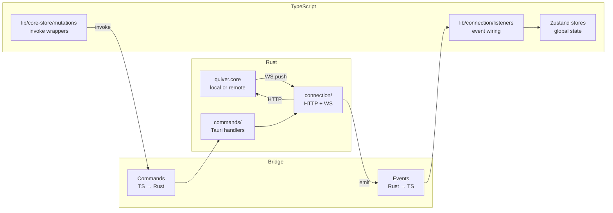
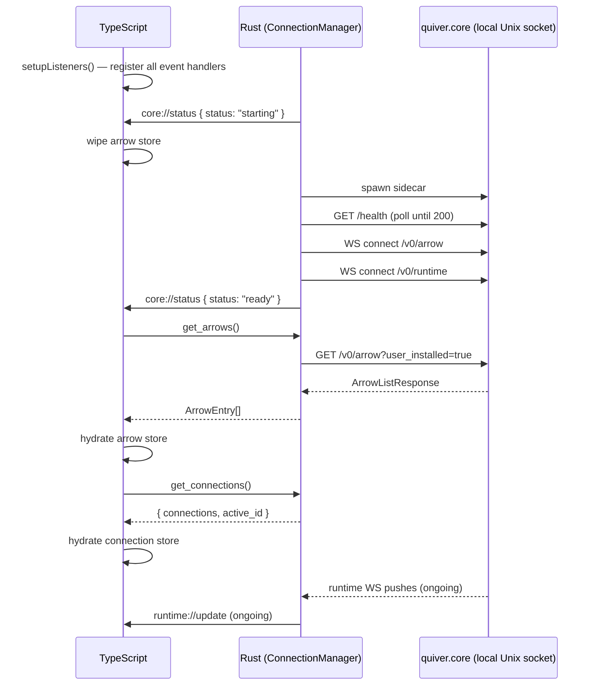

# Quiver Desktop — IPC Bridge

## Overview

The IPC bridge is the contract between the Rust backend and the TypeScript frontend inside the Tauri process. It is the only communication channel between the two sides — neither side reaches into the other's internals.

The bridge has two directions:

- **Events** (Rust → TypeScript): Rust emits typed JSON payloads that TypeScript subscribes to. Used for all reactive state updates — connection status, arrow catalog changes, and runtime transitions.
- **Commands** (TypeScript → Rust): TypeScript calls named Rust functions via `invoke()`. Used for all mutations and on-demand queries.

The TypeScript frontend never connects directly to quiver.core. All quiver.core interaction is owned by Rust. TypeScript's only job is to maintain state from events and dispatch commands.

Related specs: [connection-architecture.md](connection-architecture.md) (Rust + TypeScript implementation).

---

## 1. Architecture



The Rust side maintains one `ConnectionManager` as Tauri managed state. It holds the list of configured connections and the single active `QuiverConnection` — either a local Unix socket connection or a remote TCP connection. Commands receive it via `State<'_, ConnectionManager>`.

The TypeScript side maintains `useArrowStore` and `useConnectionStore` Zustand instances. Both are populated exclusively by Tauri events and command responses — never by direct HTTP calls to quiver.core.

---

## 2. Events (Rust → TypeScript)

Events are emitted by the Rust `Emitter` trait, implemented on `AppHandle`. All payloads are serialised as JSON. TypeScript subscribes via `listen()` from `@tauri-apps/api/event`.

### 2.1 Event Catalog

| Event | When emitted | Frequency |
|---|---|---|
| `core://status` | Connection start, ready, disconnect, or switch | Low — lifecycle only |
| `arrow://event` | Arrow upserted or removed on the catalog WS | Low — user-triggered |
| `runtime://update` | Every ArrowRuntime WS push from quiver.core | High — every step transition |
| `connection://changed` | Any connection mutation (add, remove, switch, rename) | Low — user-triggered |

---

### 2.2 `core://status`

Emitted when the active connection lifecycle state changes. TypeScript uses this to show a connection indicator in the UI. On `starting`, TypeScript wipes the arrow store. On `ready`, TypeScript calls `get_arrows()` and `get_connections()` to hydrate.

**Payload:**

```typescript
{ status: "starting" | "ready" | "disconnected" }
```

**Sequence — initial launch (local connection):**

```
ConnectionManager starts  → emit { status: "starting" }
Health check passes       → emit { status: "ready" }   ← TS hydrates here
Connection lost           → emit { status: "disconnected" }
```

**Sequence — connection switch:**

```
switch_connection called  → teardown active WS
                          → emit { status: "starting" }   ← TS wipes store here
New connection starts     → emit { status: "ready" }      ← TS hydrates here
```

---

### 2.3 `arrow://event`

Emitted on every message from the `/v0/arrow` WebSocket channel. Covers both upserts and removals. TypeScript performs an O(1) map update keyed on `namespace`.

**Payload:**

```typescript
{
    event:        "upserted" | "removed"
    namespace:    string           // versioned: "github.com/user/repo@v1.0.0"
    name?:        string
    description?: string
    tags?:        string[]
    icon?:        string | null
    banner?:      string | null
}
```

For `removed` events, only `namespace` is present. For `upserted` events, all fields are present.

`icon` and `banner` are available after quiver.core PR #184 lands.

---

### 2.4 `runtime://update`

Emitted on every message from the `/v0/runtime` WebSocket channel. This is the highest-frequency event — it fires on every state transition and step advancement. TypeScript performs an O(1) map update; no diffing, no re-renders for unrelated arrows.

**Payload:**

```typescript
{
    namespace:   string        // versioned: "github.com/user/repo@v1.0.0"
    state:       ArrowState
    active_run:  ActiveRun | null
    last_return: Return | null   // slim — method + outcome only, no steps
}
```

Where `ArrowState` is one of:

```
absent | installing | updating | ready | running |
stopping | draining | detached | uninstalling | removed | outdated
```

`last_return` carries only `{ method, outcome }` — the full step history of a completed execution is fetched on demand via `get_arrow_detail` when the user opens the detail view.

---

### 2.5 `connection://changed`

Emitted after every connection mutation — add, remove, switch, or rename. TypeScript never derives connection state independently; this event is the single source of truth.

**Payload:**

```typescript
{
    connections: ConnectionConfig[]
    active_id:   string
}
```

---

## 3. TypeScript Store

`useArrowStore` holds one merged entry per versioned namespace, built from two channels:

```typescript
interface ArrowEntry {
    // from arrow://event / get_arrows()
    namespace:   string
    name:        string
    description: string
    tags:        string[]
    icon:        string | null
    banner:      string | null
    version:     string
    state:       ArrowState      // overwritten by runtime://update on each push

    // from runtime://update
    active_run:  ActiveRun | null
    last_return: Return | null
}
```

An entry may exist with display fields but no runtime fields (runtime update not yet received). The UI must tolerate this state without crashing.

`useConnectionStore` holds `{ connections: ConnectionConfig[], activeId: string }`, updated only from `connection://changed` events and the initial `get_connections()` response.

---

## 4. Commands (TypeScript → Rust)

Commands are invoked via `invoke(commandName, args)` from `@tauri-apps/api/core`. All commands are async. On success they resolve to the specified return type. On failure they reject with a structured `CommandError`.

TypeScript never calls quiver.core HTTP endpoints directly — all reads and writes go through Rust commands.

### 4.1 Command Catalog

**quiver.core mutation commands** — proxied through the active connection:

| Command | HTTP method | quiver.core endpoint |
|---|---|---|
| `install` | POST | `/v0/runtime/{ns}/install` |
| `uninstall` | POST | `/v0/runtime/{ns}/uninstall` |
| `execute` | POST | `/v0/runtime/{ns}/{method}` |
| `stop` | POST | `/v0/runtime/{ns}/stop` |
| `register_arrow` | POST | `/v0/arrow/{ns}` |
| `remove_arrow` | DELETE | `/v0/arrow/{ns}` |
| `follow_collection` | POST | `/v0/collection/{ns}/follow` |
| `unfollow_collection` | DELETE | `/v0/collection/{ns}/follow` |

**quiver.core query commands** — proxied through the active connection:

| Command | HTTP method | quiver.core endpoint | Returns |
|---|---|---|---|
| `get_arrows` | GET | `/v0/arrow?user_installed=true` | `ArrowEntry[]` (slim) |
| `get_arrow_detail` | GET | `/v0/arrow/{ns}` | `ArrowDetailDTO` |

**Connection management commands** — handled entirely in Rust, do not call quiver.core:

| Command | Returns | Description |
|---|---|---|
| `get_connections` | `{ connections, active_id }` | Current connection list and active ID |
| `add_connection` | `ConnectionConfig` | Persist new remote connection |
| `remove_connection` | `void` | Delete connection metadata and token |
| `switch_connection` | `void` | Tear down active, start new connection |
| `rename_connection` | `void` | Update display name only |

---

### 4.2 Runtime commands

**`install`**

```typescript
invoke('install', {
    namespace: string,
    variables?: Record<string, string>
}): Promise<void>
```

Triggers `POST /v0/runtime/{ns}/install`. Returns as soon as quiver.core accepts the command (202). Progress is observed via `runtime://update` events.

**`uninstall`**

```typescript
invoke('uninstall', {
    namespace: string,
    variables?: Record<string, string>
}): Promise<void>
```

**`execute`**

```typescript
invoke('execute', {
    namespace: string,
    method:    string,    // "_execute", "_update", or a custom method name
    variables?: Record<string, string>
}): Promise<void>
```

**`stop`**

```typescript
invoke('stop', {
    namespace: string
}): Promise<void>
```

---

### 4.3 Arrow commands

**`register_arrow`**

```typescript
invoke('register_arrow', {
    namespace: string
}): Promise<void>
```

**`remove_arrow`**

```typescript
invoke('remove_arrow', {
    namespace: string    // must include @ref (e.g. github.com/user/repo@v1.0.0)
}): Promise<void>
```

**`get_arrows`**

```typescript
invoke('get_arrows'): Promise<ArrowEntry[]>
```

Returns the slim arrow list — display fields and current `state` per versioned namespace. Called on `core://status: ready` and on-demand for resync.

**`get_arrow_detail`**

```typescript
invoke('get_arrow_detail', {
    namespace: string
}): Promise<ArrowDetailDTO>
```

Returns the full detail for a single arrow including targets, requirements, dependencies, and full `last_return`. Not stored — fetched when the user opens a detail view.

---

### 4.4 Collection commands

**`follow_collection`**

```typescript
invoke('follow_collection', {
    namespace: string
}): Promise<void>
```

**`unfollow_collection`**

```typescript
invoke('unfollow_collection', {
    namespace: string
}): Promise<void>
```

---

### 4.5 Connection commands

**`get_connections`**

```typescript
invoke('get_connections'): Promise<{ connections: ConnectionConfig[], active_id: string }>
```

Returns the full connection list and active ID. Called on `core://status: ready` and on-demand for resync. Supersedes `list_connections`.

**`add_connection`**

```typescript
invoke('add_connection', {
    name:  string,
    url:   string,    // e.g. "tcp://10.0.1.5:40257"
    token: string,
}): Promise<ConnectionConfig>
```

Persists the connection metadata to the store and the token to the OS keychain. Negotiates API version via `GET /versions` against the remote host before returning. Picks the highest version in `api.supported` that the desktop can speak; falls back to `v0` on 404.

**`remove_connection`**

```typescript
invoke('remove_connection', {
    id: string
}): Promise<void>
```

The local connection (`id: "local"`) cannot be removed — returns an error.

**`switch_connection`**

```typescript
invoke('switch_connection', {
    id: string
}): Promise<void>
```

Tears down the active connection and starts the new one. Emits `core://status: starting` immediately, then `core://status: ready` once the new connection is ready.

**`rename_connection`**

```typescript
invoke('rename_connection', {
    id:   string,
    name: string,
}): Promise<void>
```

---

## 5. Error Model

All Rust commands return a structured error on failure. TypeScript receives a rejected `Promise<CommandError>`.

```typescript
interface CommandError {
    code:    number   // HTTP status code
    message: string   // human-readable, safe to display
}
```

| code | source | meaning |
|---|---|---|
| 400 | quiver.core | invalid namespace |
| 404 | quiver.core | not found / method not found |
| 409 | quiver.core | already exists / cyclic dependency |
| 422 | quiver.core | state violation / missing variable / invalid manifest / platform not supported |
| 502 | quiver.core | fetch failed (manifest registry unreachable) |
| 503 | Rust | connection-level failure (socket unreachable, sidecar crash) |
| 500 | quiver.core | internal error |

TanStack `useMutation` surfaces the rejection via its `error` field. State transitions triggered by a rejected command are not reflected in the store — the WS runtime channel is the authoritative source of state, not the command response.

---

## 6. Startup Sequence



TypeScript must call `setupListeners()` before the Rust startup sequence emits its first event. In practice this is guaranteed because `setupListeners()` is called synchronously in `main.tsx` before the React tree mounts, and Rust's setup hook runs after the Tauri webview is ready.

---

## 7. Namespace Encoding

Namespaces passed to commands contain `/` characters. Rust percent-encodes them before appending to quiver.core URLs (`/` → `%2F`). TypeScript passes raw versioned namespaces to `invoke()` — no encoding needed on the TypeScript side.

```
TypeScript:  "github.com/user/repo@v1.0.0"
Rust sends:  /v0/runtime/github.com%2Fuser%2Frepo@v1.0.0/install
```

---

## Cross-References

- [connection-architecture.md](connection-architecture.md) — full architecture: `ConnectionManager`, `QuiverConnection` trait, core-store module structure, DTO versioning, indentation enforcement
