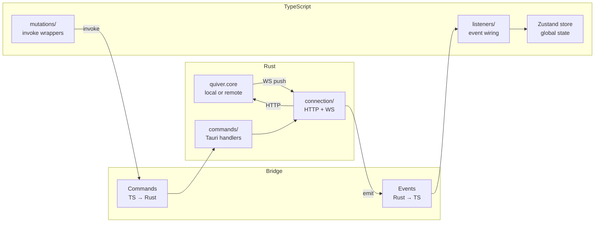
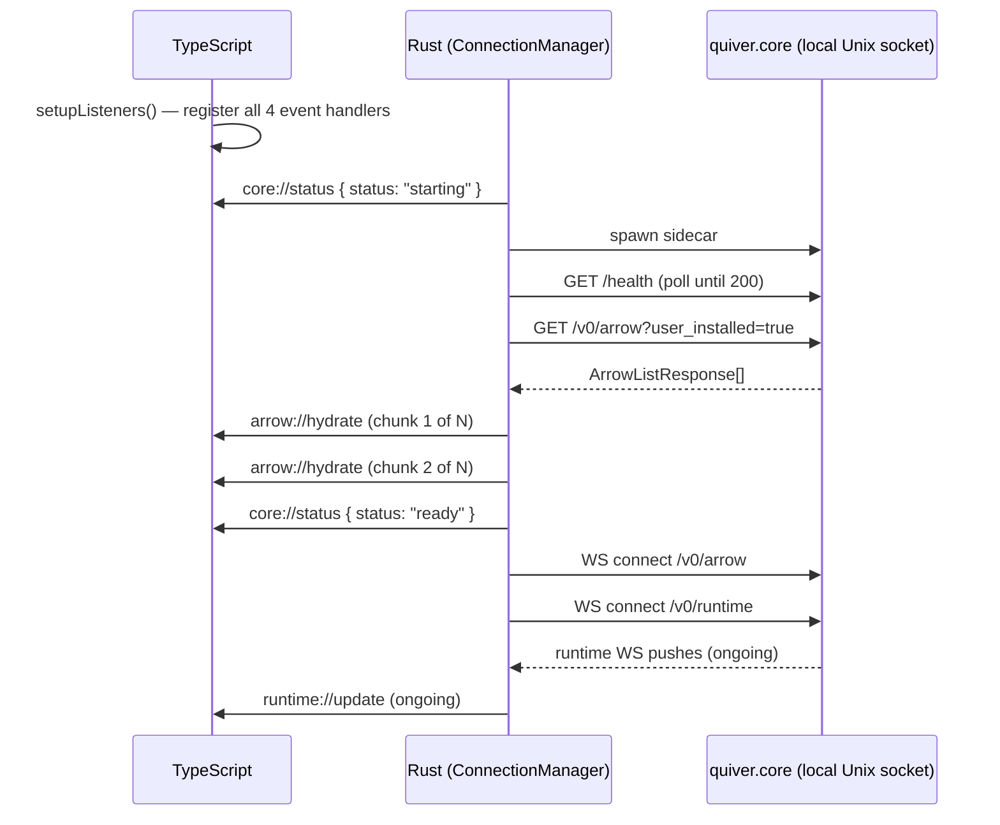

# Quiver Desktop — IPC Bridge

## Overview

The IPC bridge is the contract between the Rust backend and the TypeScript frontend inside the Tauri process. It is the only communication channel between the two sides — neither side reaches into the other's internals.

The bridge has two directions:

- **Events** (Rust → TypeScript): Rust emits typed JSON payloads that TypeScript subscribes to. Used for all reactive state updates — connection status, arrow catalog changes, and runtime transitions.
- **Commands** (TypeScript → Rust): TypeScript calls named Rust functions via `invoke()`. Used for all mutations — installing, uninstalling, executing, registering, following, and managing connections.

The TypeScript frontend never connects directly to quiver.core. All quiver.core interaction is owned by Rust. TypeScript's only job is to maintain state from events and dispatch commands.

Related specs: [connection-architecture.md](connection-architecture.md) (Rust + TypeScript implementation).

---

## 1. Architecture



The Rust side maintains one `ConnectionManager` as Tauri managed state. It holds the list of configured connections and the single active `QuiverConnection` — either a local Unix socket connection or a remote TCP connection. Commands receive it via `State<'_, ConnectionManager>`.

The TypeScript side maintains `useArrowStore` and `useConnectionStore` Zustand instances. Both are populated exclusively by Tauri events and command responses — never by direct HTTP calls to quiver.core.

---

## 2. Events (Rust → TypeScript)

Events are emitted by the Rust `Emitter` trait, implemented on `AppHandle`. All payloads are serialised as JSON. TypeScript subscribes via `listen()` from `@tauri-apps/api/event`.

### 2.1 Event Catalog

| Event | When emitted | Frequency |
|---|---|---|
| `core://status` | Connection start, ready, disconnect, or switch | Low — lifecycle only |
| `arrow://hydrate` | Startup hydration and after any catalog structural change | Low — user-triggered |
| `arrow://remove` | Arrow tombstoned (`removed: true` on WS push) | Low — user-triggered |
| `runtime://update` | Every ArrowRuntime WS push from quiver.core | High — every step transition |

---

### 2.2 `core://status`

Emitted when the active connection lifecycle state changes. TypeScript uses this to show a connection indicator in the UI. Also emitted at the start of a connection switch — TypeScript wipes the arrow store on `starting` and re-hydrates from the incoming connection's events.

**Payload:**

```typescript
{ status: "starting" | "ready" | "disconnected" }
```

**Sequence — initial launch (local connection):**

```
ConnectionManager starts  → emit { status: "starting" }
Health check passes       → emit { status: "ready" }
Connection lost           → emit { status: "disconnected" }
```

**Sequence — connection switch:**

```
switch_connection called  → teardown active WS
                          → emit { status: "starting" }   ← TypeScript wipes store here
New connection starts     → emit { status: "ready" }
```

---

### 2.3 `arrow://hydrate`

Emitted in chunks of up to 100 items. TypeScript merges each chunk into the store without wiping existing entries. Emitted on two occasions:

1. **Startup** — after sidecar is ready, Rust fetches `GET /v0/arrow?user_installed=true` and streams the result in 100-item chunks.
2. **Catalog change** — after any `arrow.added` or structural WS event, Rust re-fetches the full list and re-emits all chunks.

**Payload:**

```typescript
ArrowListItem[]   // up to 100 items per event
```

Where `ArrowListItem` is:

```typescript
{
    namespace:    string        // versioned: "github.com/user/repo@v1.0.0"
    name:         string
    version:      string
    state:        ArrowState
    active_run:   ActiveRun | null
    last_outcome: LastOutcome | null
}
```

**Note:** `active_run` is `null` in hydration payloads — the list endpoint does not carry execution state. The runtime WS fills it in immediately after. The gap is milliseconds.

---

### 2.4 `arrow://remove`

Emitted when the Arrow WS channel pushes a message with `removed: true`. TypeScript removes the entry from the store by namespace key.

**Payload:**

```typescript
{ namespace: string }   // versioned namespace: "github.com/user/repo@v1.0.0"
```

---

### 2.5 `runtime://update`

Emitted on every message from the `/v0/runtime` WebSocket channel. This is the highest-frequency event — it fires on every state transition and step advancement. TypeScript performs an O(1) map update; no diffing, no re-renders for unrelated arrows.

**Payload:**

```typescript
{
    namespace:    string        // versioned: "github.com/user/repo@v1.0.0"
    state:        ArrowState
    active_run:   ActiveRun | null
    last_outcome: LastOutcome | null   // slim — method + outcome only, no steps
}
```

Where `ArrowState` is one of:

```
absent | installing | updating | ready | running |
stopping | draining | detached | uninstalling | removed | outdated
```

`last_outcome` carries only `{ method, outcome }` — the full step history of a completed execution is fetched on demand via `GET /v0/arrow/{ns}` when the user opens the detail view.

---

## 3. Commands (TypeScript → Rust)

Commands are invoked via `invoke(commandName, args)` from `@tauri-apps/api/core`. All commands are async. On success they resolve to `void`. On failure they reject with a `string` error message from Rust.

TypeScript never calls quiver.core HTTP endpoints for mutations — all writes go through Rust commands.

### 3.1 Command Catalog

**quiver.core commands** — proxied through the active connection:

| Command | HTTP method | quiver.core endpoint |
|---|---|---|
| `install` | POST | `/v0/runtime/{ns}/install` |
| `uninstall` | POST | `/v0/runtime/{ns}/uninstall` |
| `execute` | POST | `/v0/runtime/{ns}/{method}` |
| `stop` | POST | `/v0/runtime/{ns}/stop` |
| `register_arrow` | POST | `/v0/arrow/{ns}` |
| `remove_arrow` | DELETE | `/v0/arrow/{ns}` |
| `follow_collection` | POST | `/v0/collection/{ns}/follow` |
| `unfollow_collection` | DELETE | `/v0/collection/{ns}/follow` |

**Connection management commands** — handled entirely in Rust, do not call quiver.core:

| Command | Returns | Description |
|---|---|---|
| `list_connections` | `ConnectionConfig[]` | All configured connections (no tokens) |
| `add_connection` | `ConnectionConfig` | Persist new remote connection |
| `remove_connection` | `void` | Delete connection metadata and token |
| `switch_connection` | `void` | Tear down active, start new connection |
| `rename_connection` | `void` | Update display name only |

---

### 3.2 Runtime commands

**`install`**

```typescript
invoke('install', {
    namespace: string,              // versioned namespace
    variables?: Record<string, string>
}): Promise<void>
```

Triggers `POST /v0/runtime/{ns}/install`. Returns as soon as quiver.core accepts the command (202). Progress is observed via `runtime://update` events.

**`uninstall`**

```typescript
invoke('uninstall', {
    namespace: string,
    variables?: Record<string, string>
}): Promise<void>
```

**`execute`**

```typescript
invoke('execute', {
    namespace: string,
    method:    string,              // "_execute", "_update", or a custom method name
    variables?: Record<string, string>
}): Promise<void>
```

**`stop`**

```typescript
invoke('stop', {
    namespace: string
}): Promise<void>
```

---

### 3.3 Arrow commands

**`register_arrow`**

```typescript
invoke('register_arrow', {
    namespace: string               // versioned namespace
}): Promise<void>
```

Triggers `POST /v0/arrow/{ns}`. Synchronous — quiver.core confirms registration before returning.

**`remove_arrow`**

```typescript
invoke('remove_arrow', {
    namespace: string               // must include @ref (e.g. github.com/user/repo@v1.0.0)
}): Promise<void>
```

Triggers `DELETE /v0/arrow/{ns}`. Synchronous.

---

### 3.4 Collection commands

**`follow_collection`**

```typescript
invoke('follow_collection', {
    namespace: string
}): Promise<void>
```

**`unfollow_collection`**

```typescript
invoke('unfollow_collection', {
    namespace: string
}): Promise<void>
```

---

### 3.5 Connection commands

**`list_connections`**

```typescript
invoke('list_connections'): Promise<ConnectionConfig[]>
```

Returns all configured connections. Tokens are never included. The local connection is always first in the list.

**`add_connection`**

```typescript
invoke('add_connection', {
    name:  string,
    url:   string,    // e.g. "tcp://10.0.1.5:40257"
    token: string,
}): Promise<ConnectionConfig>
```

Persists the connection metadata to the store and the token to the OS keychain. Negotiates API version via `GET /version` against the remote host before returning.

**`remove_connection`**

```typescript
invoke('remove_connection', {
    id: string
}): Promise<void>
```

The local connection (`id: "local"`) cannot be removed — returns an error.

**`switch_connection`**

```typescript
invoke('switch_connection', {
    id: string
}): Promise<void>
```

Tears down the active connection and starts the new one. Emits `core://status: starting` immediately, then `core://status: ready` once the new connection is hydrated.

**`rename_connection`**

```typescript
invoke('rename_connection', {
    id:   string,
    name: string,
}): Promise<void>
```

---

## 4. Error Model

Rust maps quiver.core HTTP errors to string messages before returning them to TypeScript. TypeScript receives a rejected `Promise<string>`.

| quiver.core status | Rust behaviour | TypeScript sees |
|---|---|---|
| 202 Accepted | Resolve `Ok(())` | Promise resolves |
| 4xx Client error | `Err(response body or status)` | Promise rejects with message string |
| 5xx Server error | `Err("internal error")` | Promise rejects with message string |
| Network failure | `Err("request failed: ...")` | Promise rejects with message string |

TanStack `useMutation` surfaces the rejection via its `error` field. State transitions triggered by a rejected command are not reflected in the store — the WS runtime channel is the authoritative source of state, not the command response.

---

## 5. Startup Sequence



TypeScript must call `setupListeners()` before the Rust startup sequence emits its first event. In practice this is guaranteed because `setupListeners()` is called synchronously in `main.tsx` before the React tree mounts, and Rust's setup hook runs after the Tauri webview is ready.

---

## 6. Namespace Encoding

Namespaces passed to commands contain `/` characters. Rust percent-encodes them before appending to quiver.core URLs (`/` → `%2F`). TypeScript passes raw versioned namespaces to `invoke()` — no encoding needed on the TypeScript side.

```
TypeScript:  "github.com/user/repo@v1.0.0"
Rust sends:  /v0/runtime/github.com%2Fuser%2Frepo@v1.0.0/install
```

---

## Cross-References

- [connection-architecture.md](connection-architecture.md) — full architecture: `ConnectionManager`, `QuiverConnection` trait, core-store module structure, DTO versioning, indentation enforcement
